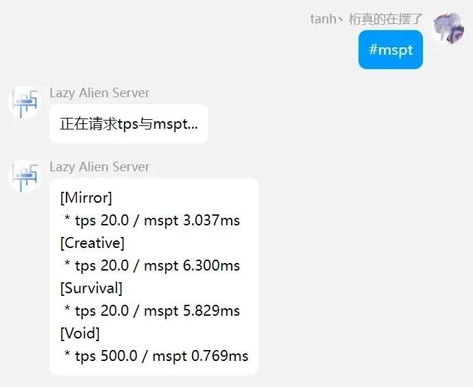

# LazyAlienWS

LazyALienWS，一个基于websocket的LAS多端互通基础python库

**使用说明：**

将lazyalienws作为python库安装，或直接将lazyalienws文件夹拖到python环境目录下

新建一个文件夹作为ws服务端运行目录，打开命令窗口输入`python -m lazyalienws`，将会自动创建目录。其中`/plugins`即为插件目录。

修改`conf.json`后再次使用`python -m lazyalienws`启动即可

在MCDR服务端的`/plugins`目录下打开命令窗口运行`python -m lazyalienws client`即可自动创建mcdr插件与服务端互通，初次创建需要在MCDR服务端`/config`设置配置文件

**目录说明**

`/lazyalienws` LazyAlienWS库的根目录

`/plugins` LazyAlienWS服务端实际运行目录下的插件

---

## 实现功能：

### 更好的Chatbridge（聊天互通）

**效果：**

**相比于fallen的传统chatbridge，优点在于？**

- 更好的显示样式，传统chatbridge互通消息全部为灰色，新chatbridge修改了颜色，更加清晰；在游戏内显示QQ消息时，QQ用户昵称将使用灰色以区分开qq互通和群组互通。

- 支持了对CQ码的处理，在QQ中的图片/表情/回复消息/at/合并转发能够在局内正常显示，其中图片/表情可以在局内以网页形式打开查看。

- 在velocity群组上套了一层mcdr，当玩家在子服中切换的时候qq不会提示进入/退出游戏，局内使用velocity chat提示切换；只有当玩家进入/退出群组时，qq才会提示。
---
### 更好的“#在线玩家”功能

效果：

**#在线玩家：** 在获取在线玩家时，同时获取team bot内的假人列表，区分开玩家和假人

**联动[BOT]：** 此功能的bot识别与<a href="https://github.com/tanhHeng/AutoBOTPrefix">AutoBOTPrefix</a>插件联动

---

### #mspt #tps 查询

效果：

*#mspt查询服务端tps和mspt，#tps同理*

---

### #签到

效果：

---

### 全服互通的MOTD欢迎

效果：

